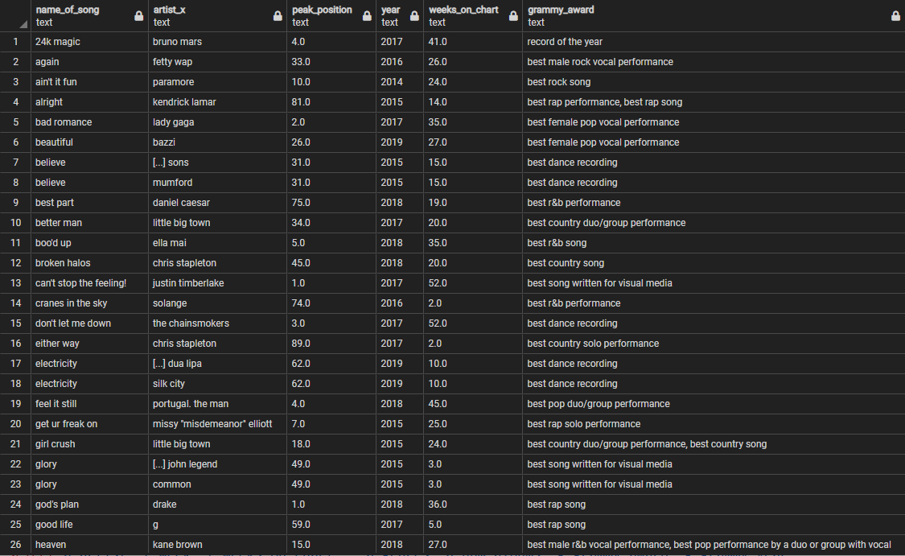

# Project_2: Billboard, Grammy, Artists

## Proposal
We have looked at data pertaining to Billboard Songs, Grammy-Awarded Songs, their respective artists, and their relationship with one another. These datasets are limited to the years 1999-2019 and were found on https://www.kaggle.com/danield2255/data-on-songs-from-billboard-19992019/version/1 conducted by Daniel DeFoe.

We used pgAdmin to upload our data into a SQL Database (relational) and to query the datasets as instructed.

After querying the provided data, we can observe that the Country music genre has the most entries in the Billboard dataset while the Rock music genre has the most entries in the Grammy dataset. We can also discern that Drake, the music artist, had the most entires in the Billboard dataset while Adele had the most entries in the Grammy dataset. 

### Instructions
Running the program:

1. Open ETL.ipynb
2. run everything and when prompted, enter pgadmin password
